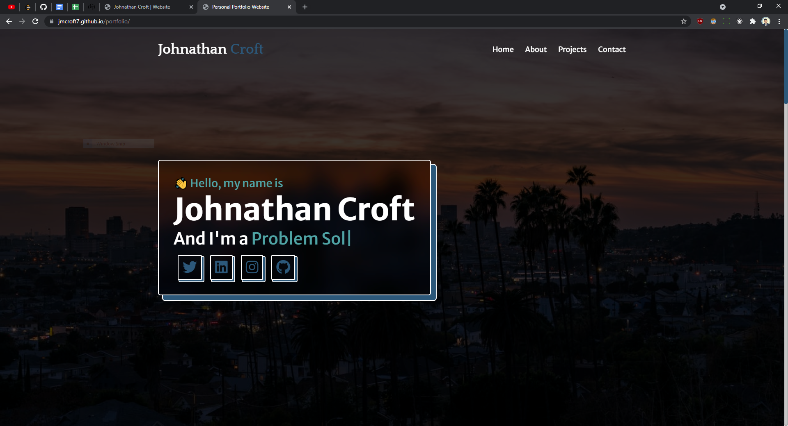

<!-- PROJECT SHIELDS -->
[![LinkedIn][linkedin-shield]][linkedin-url]

<!-- PROJECT LOGO -->
<br />
<div align="center">
  <a href="https://github.com/jmcroft7/portfolio">
    
  </a>

<h3 align="center">Portfolio</h3>

<p align="center">
    A portfolio made using html5, css3, and javascript.
    <br />
    <a href="https://github.com/jmcroft7/portfolio">View Demo</a>
</p>
</div>

<!-- ABOUT THE PROJECT -->

## About The Project

<p> My first portfolio site. This website utilizes popular UI design patterns such as Neumorphism and Glassmorphism along with popular JavaScript libraries with jQuery.js and typed.js. This site is currently live at <a href="https://jmcroft7.github.io/portfolio/">https://jmcroft7.github.io/portfolio/</a>
</p>

<p align="right">(<a href="#top">back to top</a>)</p>

### Built With

- [HTML5](https://nextjs.org/)
- [CSS3](https://reactjs.org/)
- [JavaScript](https://vuejs.org/)
- [jQuery.js](https://angular.io/)
- [typed.js](https://svelte.dev/)
- [DevIcons](https://laravel.com)
- [FontAwesome](https://getbootstrap.com)

<p align="right">(<a href="#top">back to top</a>)</p>

### Installation

1. Clone the repo
   ```sh
   git clone https://github.com/jmcroft7/portfolio.git
   ```
2. No NPM packages to install since it is just a static website.

<p align="right">(<a href="#top">back to top</a>)</p>

<!-- LICENSE -->

## License

Distributed under the MIT License. See `LICENSE.txt` for more information.

<p align="right">(<a href="#top">back to top</a>)</p>

<!-- CONTACT -->

## Contact

Johnathan Croft - [@devJohnathan](https://twitter.com/devJohnathan) - croftmjohn@gmail.com

Project Link: [https://github.com/jmcroft7/portfolio](https://github.com/jmcroft7/portfolio)

<p align="right">(<a href="#top">back to top</a>)</p>

<!-- MARKDOWN LINKS & IMAGES -->
<!-- https://www.markdownguide.org/basic-syntax/#reference-style-links -->

[linkedin-shield]: https://img.shields.io/badge/-LinkedIn-black.svg?style=for-the-badge&logo=linkedin&colorB=555
[linkedin-url]: https://www.linkedin.com/in/devjohnathan/
[product-screenshot]: images/screenshot.png
